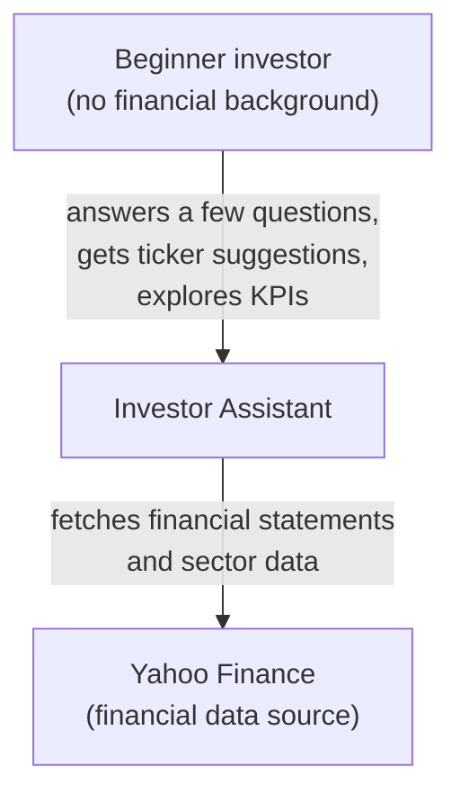
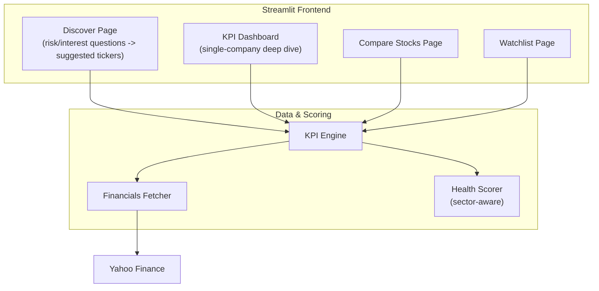

# Architecture

Two diagrams, following the C4 model: pick one zoom level per
diagram instead of mixing them. Stops at Container level -
Component/Code level diagrams aren't worth it at this project's
size yet.

## 1. System Context

Who uses this, and what does it talk to. No internal structure.

## 2. Containers

The main pieces inside the app, and how they connect. Stops here
- no individual function names, no CSS, no caching details.

